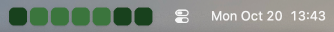

<p align="center">
  <a href="https://github.com/chamaloriz/contribution-bar#gh-light-mode-only" target="_blank">
    
  </a>
  <a href="https://github.com/chamaloriz/contribution-bar#gh-dark-mode-only" target="_blank">
    
  </a>
</p>

<p align="center">Track your GitHub activity, commits, and contributions with a minimal macOS menu bar widget.</p>

## Features

- See your GitHub activity from the last 7 days in the macOS menu bar, using an <a href="https://github.com/grubersjoe/github-contributions-api" target="_blank">unofficial GitHub API</a>.


## Installation

Download the latest version of the app from Releases tab, add it to your Applications, then run the following command :

```bash
# Removes quarantine flags from flag (to bypass security warnings). For the “damaged app” error.
xattr -cr /Applications/ContributionBar.app
```

To quit the app use the following command (temporary):

```bash
killall contribution-bar
```

## Configuration

After running the app a configuration file is generated at :

```bash
# uses nano to edit the default-config.toml
nano $HOME/Library/Application\ Support/rs.contribution-bar/default-config.toml
```

## Supported Platforms

- [x] MacOS ARM
- [x] MacOS x86
- [x] Linux
- [x] Windows ( the icon is really small, but it runs )
